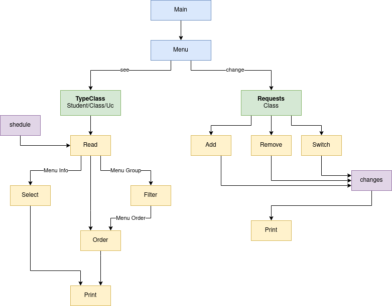

# Planner

## Project Description

This is a C++ application designed to manage schedules after they have been elaborated. If offers multiple functionalities such as schedule modification, searching, viewing, sorting and listing, among others. The main goal of this tool is to simplify the complexities of managing student schedules and class assignments.

## Installation and Usage

To run our application, follow these simple steps:

1. Open a terminal window.
2. Navigate to the src folder using the cd command:
`cd src`
3. Execute the following command to compile and run the program:
`make && ./a.out`

Please be aware that the initial compilation process may take up to 15 seconds to complete before the program can be executed.

**Note**: If the program's output exceeds the terminal window's size, you can use the following command to view the entire output and save it to a file for future reference:
`make && ./a.out | tee output.txt`

## Project Scructure

The application is structured around key components and classes. Understanding the UML diagram is essential for grasping the relationships between different modules.

## Collaboration

- Bernardo Jose Ponce Figueirado de Brito, up202301442
- Clarisse Maria Teixeira de Carvalho, up202008444
- Eduardo Oliveira Silva, up202301394

## Features

- Student/UC/Class Creation:

  > [✔] Create student;

  > [✔] Create uc;

  > [✔] Create class;

- Database Operations:

  > [✔] Read database files;

  > [✔] Keep requests and changes made in database files;

  > [✔] Print data;

- [✔] Create menu;

- Schedule Managents:

  > [✔] Schedule consultation by student/class;

  > [✔] List of students withing a class/uc/year;

  > [✔] Number of class/students withing a class/uc/year;

  > [✘] Sort class/student/Uc (asc, desc, by code, by year, etc);

- Requests Handling:

  > [✔] Add, remove, switch (Accept/Deny);

  > [✔] Undo requests managements (Accept/Deny);

- [✔] PDF;

- [✘] Complexidade;

- [✘] Doxeg...

**Schedule Class**: press: `1` -> `2` -> `1` -> <UcCode>
**Schedule Student**: press: `1` -> `3` -> <StudentCode>
**

## Restrictions

> Note that a student’s schedule may overlap classes if they are neither TP nor PL. That is, there may be overlapping classes between T and TP, between T and T, and between T and PL.

> For UC changes, consider the following rules:
> 1.A student cannot be registered in more than 7 UCs at any given time;
> 2.There must be at least one class with a vacancy in the new UC;
> 3.The resulting schedule will not conflict with the student’s original schedule.

> For class changes, consider the following rules:
> 1.A student cannot be in more than one class at once for a given UC;
> 2.A class can only accept a new student if its capacity has not been exceeded. Consider that there is a maximum capacity Cap for classes;
> 3.A class can only accept a new student if the balance between class occupation is not disturbed. The balance of class occupation is maintained when the difference between the number of students in any class is less than or equal to 4;
> 4.There is no conflict between the student’s schedule and the new class’s schedule.

> Undo requests can be accepected or denied

## Known Issues

> Everytime you create a file, you must add it to the Makefile.

## Deadline

Project Deadline: November 3, 2023

std::vector<myUc> selectUc(const std::string &str,
                           const std::map<std::string, myUc> &classes) {
  std::vector<myUc> selectedUcs;

  for (const auto &pair : classes) {
    auto ucObj = pair.second;

    if (ucObj.getUcCode() == str) {
      selectedUcs.push_back(ucObj);
    }
  

  return selectedUcs;
}